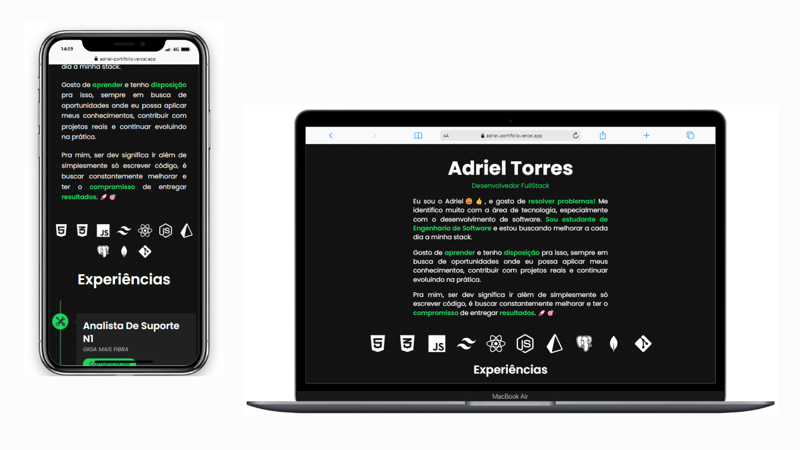

## 📜 Sobre Mim 

No meu portfólio, você encontrará uma seção dedicada onde compartilho um pouco sobre mim:
* Eu sou o Adriel 😄👍, e gosto de resolver problemas! Me identifico muito com a área de tecnologia, especialmente com o desenvolvimento de software. Sou estudante de Engenharia de Software e estou buscando melhorar a cada dia a minha stack.

## ✨ Funcionalidades Principais

* **Apresentação Pessoal Detalhada:** Uma seção dedicada para compartilhar minha trajetória, paixões e filosofia de trabalho.
* **Linha do Tempo de Experiências:** Utilizando `react-vertical-timeline-component` para exibir minhas experiências profissionais de forma interativa e visualmente agradável.
* **Destaque de Habilidades:** Soft skills e habilidades técnicas apresentadas em cada experiência.
* **Design Responsivo:** Construído com Tailwind CSS para garantir uma ótima visualização em desktops, tablets e dispositivos móveis.
* **Ícones Dinâmicos:** Uso de `react-icons` para adicionar elementos visuais aos componentes.

## 🛠️ Tecnologias Utilizadas

Este projeto foi construído utilizando as seguintes tecnologias principais:

* **React:** Biblioteca JavaScript para construir interfaces de usuário.
* **Tailwind CSS:** Framework CSS utility-first para estilização rápida e responsiva.
* **React Vertical Timeline Component:** Para criar a linha do tempo de experiências.
* **React Icons:** Para a inclusão de ícones SVG populares.
* HTML5
* CSS3
* JavaScript (ES6+)

**Prévia visual do meu portfólio:**

